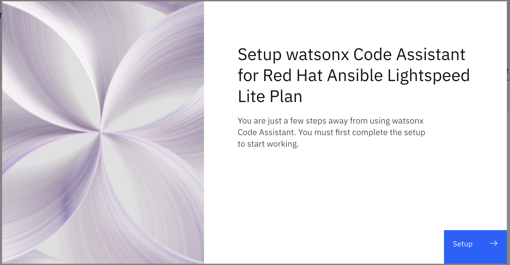
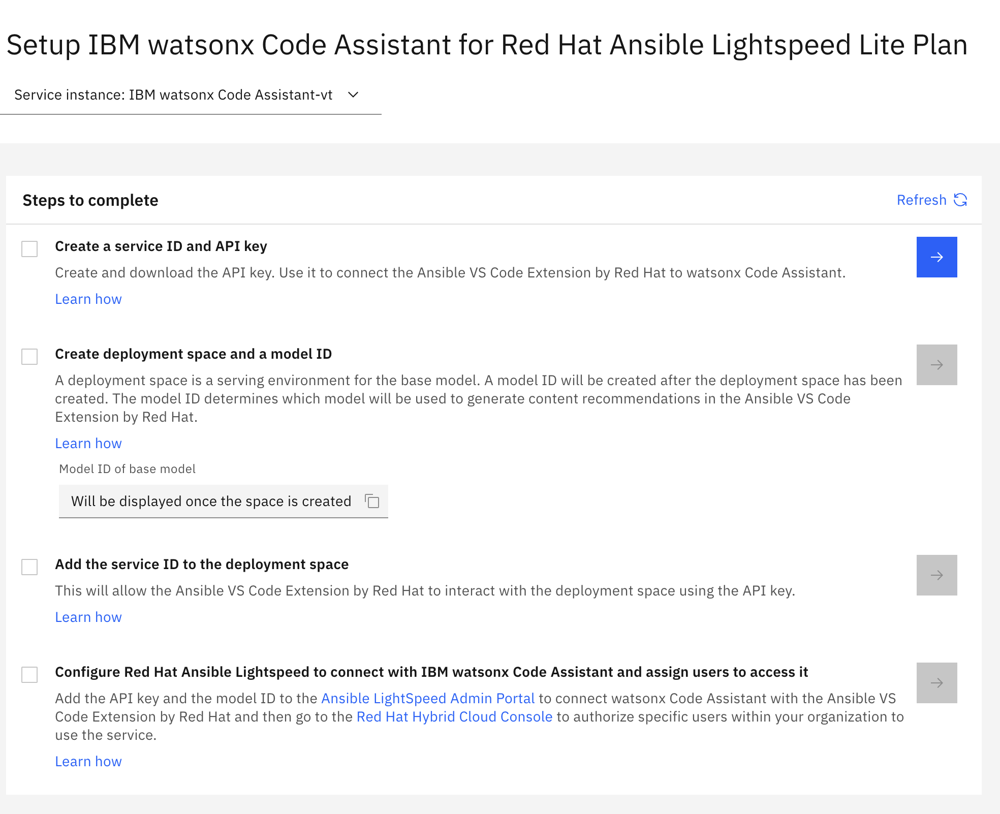

# Ansible Lightspeed

## VS Code Configuration

1. In VSCode, install the [Ansible extension](https://marketplace.visualstudio.com/items?itemName=redhat.ansible) from Red Hat
2. Open the VSCode Settings, search for Lightspeed and ensure that the following settings are enabled:
   1. `Ansible > Lightspeed`
   2. `Ansible > Lightspeed > Suggestions`
3. Click the Lightspeed box on the right side of the status bar at the bottom of VSCode
4. Use your Red Hat credentials to log in

## IBM Cloud Configuration

1. Log into your [IBM Cloud](https://cloud.ibm.com/) account
2. Create a `IBM watsonx Code Assistant` service
3. Run the setup
   1. 
   2. 
   3. Follow the instructions [here](https://cloud.ibm.com/docs/watsonx-code-assistant?topic=watsonx-code-assistant-cloud-setup-a#sid_apikey) to create a Service ID and API Key
   4. Save the API Key when presented. This can not be retrieved later.

## Red Hat AI Console Configuration

1. Go to <https://c.ai.ansible.redhat.com/console/admin/settings> and enter the API key.
2. Add the Model ID from <https://dataplatform.cloud.ibm.com/wx/setup>

## Enhancements

If the IBM Cloud account is a Standard Plan, the last step of the [setup](https://cloud.ibm.com/docs/watsonx-code-assistant?topic=watsonx-code-assistant-cloud-setup-a#create-project) allows a project to be created that can be trained on existing code so that suggestions are more in alignment with the organizations standards.

## Information

The Red Hat platform for Lightspeed is located at <https://c.ai.ansible.redhat.com/>

An [IBM Cloud account](https://cloud.ibm.com/registration) is required to use WatsonX Code Assistant to back Lightspeed. Details on how to configure are available [here](https://cloud.ibm.com/docs/watsonx-code-assistant?topic=watsonx-code-assistant-cloud-setup-a).

Service ID/API management: <https://cloud.ibm.com/iam/serviceids/>
Model management: <https://dataplatform.cloud.ibm.com/ml-runtime/spaces>
