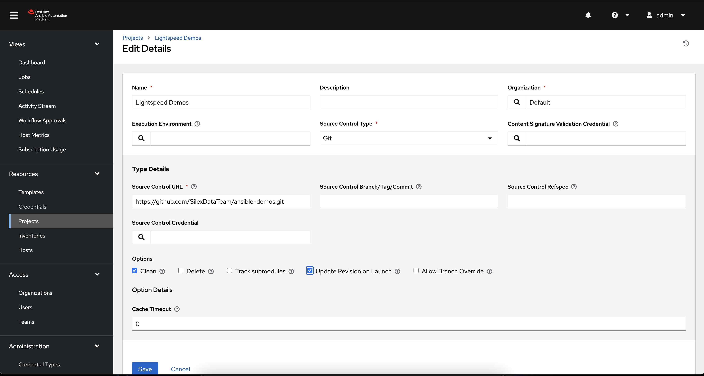

# Ansible Automation Platform setup for Lightspeed Exercises

## Execution Environment

The Demos use features that are not included in the default Execution Environment provided with AAP. To add the additional Execution environment

1. Open the AAP URL delivered as part of the Lab and login as the `admin` user using the password provided on your Lab landing page.
2. On the left hand side, navigate to `Execution Environments` toward the bottom of the sidebar.


3. Click `Add`
4. Add the `quay.io/acme_corp/lightspeed-101_ee:latest` Execution Environment to your AAP Controller


## Project Repository

Setting up this repository as a Project in Ansible Automation Platform will allow the playbooks run/created to be executed from AAP.

If you would like to make/save changes, please use a GitHub account to fork <https://github.com/SilexDataTeam/ansible-demos> into your own account and use that URL for the remaining steps. Otherwise, you can use this link.

### Clone to the Control Node

To use the repository in the remote VSCode session, it needs to be cloned to the /home/student directory in your VSCode Terminal

```shell
git clone https://github.com/SilexDataTeam/ansible-demos
```


### Project in AAP

Add a Project to pull the repository into AAP

1. On the left hand side, navigate to `Projects` in the `Resources` section of the sidebar.
2. Click `Add`
3. Add the Project to your AAP Controller with the following settings:



### Job Template in AAP

Add a Job Template to run one of the playbooks from the repository via AAP

1. On the left hand side, navigate to `Templates` in the `Resources` section of the sidebar.
2. Click `Add`
3. Add the Project to your AAP Controller with the following settings:


Additional Job Templates can be created for the other playbooks in the repository.
