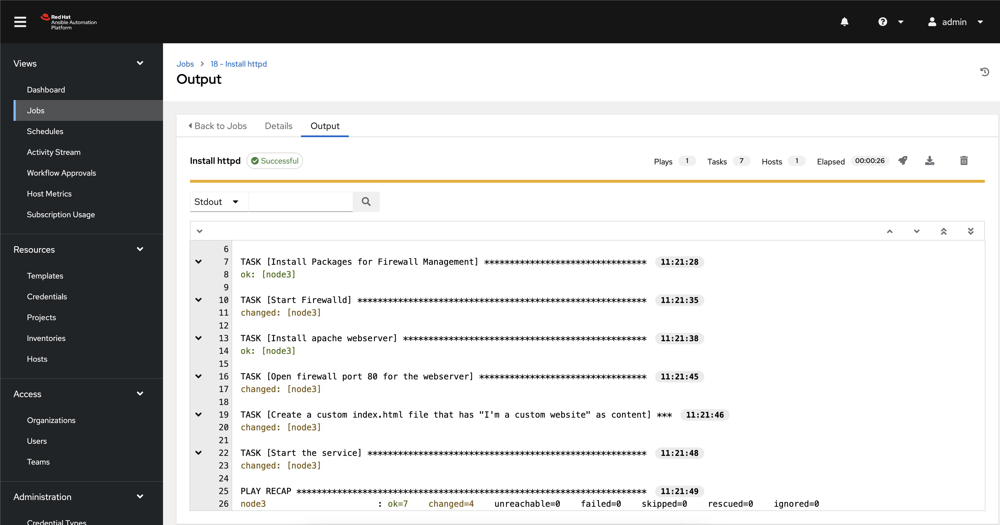

# Installing Apache from the Lightspeed-generated Playbook

## Run the Job Template

1. Open the AAP URL delivered as part of the Lab and login as the `admin` user using the password provided on your Lab landing page.
2. On the left hand side, navigate to `Templates` in the `Resources` section of the sidebar.
3. Click the rocket ship icon at the far right of the `Install httpd` Job Template


4. If desired, provide a limit to restrict which hosts the job will run against. `node1`, `node2` and `node3` are all part of the `web` group. If left blank, the job will run against all 3 nodes.


5. The job results will look similar to below.



6. The web configuration can be validated by using `curl` from the control node.

```shell
curl http://node1
```


