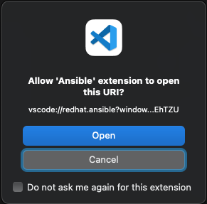

# VSCode Setup for Ansible Lightspeed Exercises

These instructions allow the use of the Red Hat Ansible for RHEL Workshop lab environment to be used with Ansible Lightspeed.

## Assumptions

* VSCode installed on your local computer
* Access to a Red Hat provisioned lab (<https://aap2.demoredhat.com/exercises/ansible_rhel/>). The link to this lab environment will be provided during the workshop.
* Access to IBM WatsonX for Ansible Lightspeed. There is a free 90 day trial available by following the instructions at <https://www.redhat.com/en/products/interactive-walkthrough/install-ansible-lightspeed>

## Instructions

1. Install the `Remote - SSH` extension from Microsoft in VSCode
   1. Click the gear icon in the lower left corner
   2. Click Extensions
   3. Search for `Remote - SSH`
   4. Click `Install` on the extension

   

2. Install the `Ansible` extension from Red Hat in VSCode
   1. Search for `Ansible`
   2. Click `Install` on the extension

   

3. Connect to the SSH Host in the Red Hat Lab
   1. From your lab instruction page, identify the Red Hat Enterprise Linux Development Host information

   

   2. In VSCode, open the Command Pallete by using the shortcut or going to `View -> Command Pallete` in the menu.
   3. Search for `Remote Connect`

   

   4. Select `Connect Current Window to Host`
   5. Copy/enter the `student@ansible-1.*.opentlc.com` and press enter.

   

   6. If prompted, click Continue to accept the fingerprint and enter the password provided

   

4. Prepare VSCode and the environment for Ansible
   1. After logging in, a layout similar to this will be visible:

   

   2. Click `Open Folder` and leave `/home/student` in the dialog. Click OK.

   

   3. Click `Yes, I trust the authors` when prompted

   

   4. Open a new Terminal Window by clicking `Terminal -> New Terminal` in the menu. This should result in a layout similar to this:

   

5. Create Python Virtual Environment for Ansible
   1. In the terminal, execute the following comands:
   ```bash
   [student@ansible-1 ~]$ python3.12 -m venv /home/student/ansible-venv
   [student@ansible-1 ~]$ source /home/student/ansible-venv/bin/activate
   (ansible-venv) [student@ansible-1 ~]$ pip install "ansible-core<2.17.0" ansible-lint
   ```
   2. Validate Ansible version
   ```
   (ansible-venv) [student@ansible-1 ~]$ ansible --version
   ```
   Resulting in something similar to:
   ```
   ansible [core 2.16.11]
     config file = /etc/ansible/ansible.cfg
     configured module search path = ['/home/student/.ansible/plugins/modules', '/usr/share/ansible/plugins/modules']
     ansible python module location = /home/student/ansible-venv/lib64/python3.12/site-packages/ansible
     ansible collection location = /home/student/.ansible/collections:/usr/share/ansible/collections
     executable location = /home/student/ansible-venv/bin/ansible
     python version = 3.12.1 (main, Feb 21 2024, 10:25:11) [GCC 8.5.0 20210514 (Red Hat 8.5.0-21)] (/home/student/ansible-venv/bin/python3.12)
     jinja version = 3.1.4
     libyaml = True
   ```
   3. Validate Ansible can reach lab
   ```
   (ansible-venv) [student@ansible-1 ~]$ ansible -m ping -i lab_inventory/ all
   ```
   Resulting in something similar to:
   ```
   node1 | SUCCESS => {
      "ansible_facts": {
        "discovered_interpreter_python": "/usr/libexec/platform-python"
      },
    "changed": false,
    "ping": "pong"
   }
   node3 | SUCCESS => {
      "ansible_facts": {
        "discovered_interpreter_python": "/usr/libexec/platform-python"
      },
    "changed": false,
    "ping": "pong"
   }
   ansible-1 | SUCCESS => {
      "ansible_facts": {
        "discovered_interpreter_python": "/usr/libexec/platform-python"
      },
    "changed": false,
    "ping": "pong"
   }
   node2 | SUCCESS => {
      "ansible_facts": {
        "discovered_interpreter_python": "/usr/libexec/platform-python"
      },
    "changed": false,
    "ping": "pong"
   }
   ```
6. Connect VSCode to your Lightspeed Account
   1. Click on the Ansible extension icon in the toolbar
   2. Click the `Connect` button in the Ansible Lightspeed tab

   

   3. Click `Allow` to allow VSCode to connect to Red Hat to sign in to Lightspeed

   4. Click `Open` to go to the authentication website

   

   5. Click `Log in with Red Hat`

   

   6. Login using your Red Hat account

   

   7. Click `Authorize` to link VSCode to Red Hat

   

   8. Click the `Open Visual Studio Code` button

   
   9. Click the `Open` button to allow Ansible to open the URI

   

   10. Confirm Lightspeed is connected

   

7. Configure VSCode to run ansible-lint while editing
   1. Open Settings by clicking the gear icon and Settings.
   2. Change to the Remote settings tab and search for `Ansible`

   

   3. Configure VSCode to activate the python virtual environment

   

   4. Enable Lightspeed and Lightspeed Suggestions

   

8. Open the /home/student folder
   1. Click on the Explorer icon at the top of the toolbar on the left of the screen
   2. Click the `Open Folder` button

   

   3. Click the `Yes I trust the Authors` button

   
