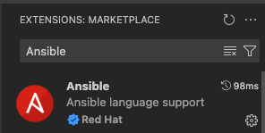
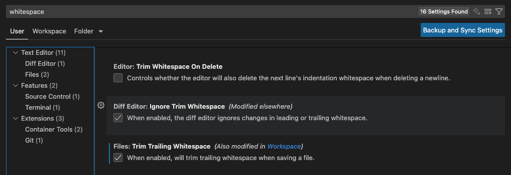
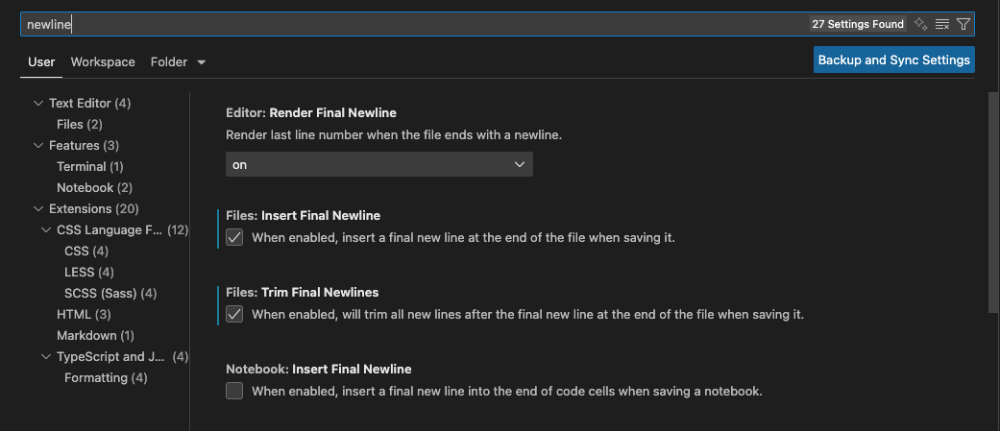
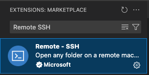
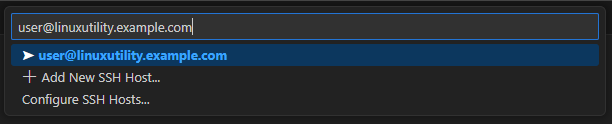
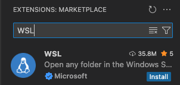
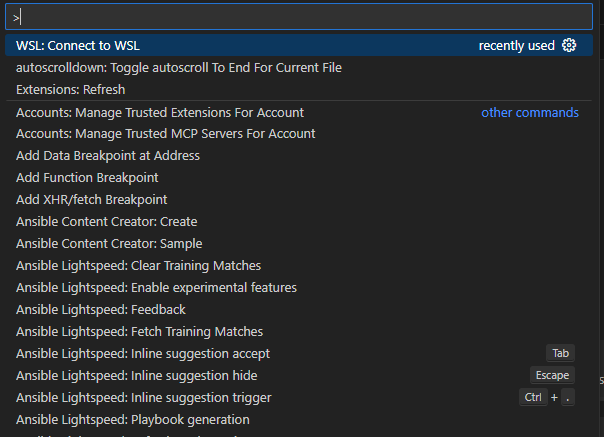
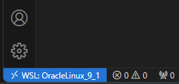
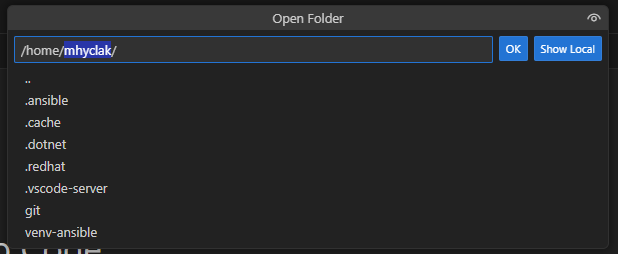

# Ansible and VSCode

VSCode has plugins created to make Ansible development easier. This document walks through some ways it can be configured.

## Python Virtual Environment

Setting up a separate Python virtual environment keeps any changes needed for versions of Ansible separate from the system Python.

### Linux/MacOS/WSL

1. Create the environment using the version of Python you would like. Generally this should be a recent version of Python 3 as documented on the [Ansible Docs Release and Maintenance](https://docs.ansible.com/ansible/latest/reference_appendices/release_and_maintenance.html#support-life) page. Targeting a specific version of Ansible core is recommended to ensure alignment with your Automation Platform Execution Environments. In this example, we are targeting Ansible 2.17 using Python 3.12 and installing the ansible-dev-tools package which contains several helpful utilities.

    ```shell
    [mhyclak@Matts-Mac-mini ~]$ python3.12 -m venv ~/ansible-2.17
    [mhyclak@Matts-Mac-mini ~]$ source ~/ansible-2.17/bin/activate
    (ansible-2.17) [mhyclak@Matts-Mac-mini ~]$ pip install --upgrade pip
    Requirement already satisfied: pip in ./ansible-2.17/lib/python3.12/site-packages (25.0)
    Collecting pip
      Downloading pip-25.2-py3-none-any.whl.metadata (4.7 kB)
    Downloading pip-25.2-py3-none-any.whl (1.8 MB)
      ━━━━━━━━━━━━━━━━━━━━━━━━━━━━━━━━━━━━━━━━ 1.8/1.8 MB 2.0 MB/s eta 0:00:00
    Installing collected packages: pip
      Attempting uninstall: pip
        Found existing installation: pip 25.0
        Uninstalling pip-25.0:
          Successfully uninstalled pip-25.0
    Successfully installed pip-25.2
    (ansible-2.17) [mhyclak@Matts-Mac-mini ~]$ pip install ansible-dev-tools 'ansible-core<2.18.0'
    Collecting ansible-dev-tools
      Using cached ansible_dev_tools-25.8.3-py3-none-any.whl.metadata (10 kB)
    Collecting ansible-core<2.18.0
      Using cached ansible_core-2.17.13-py3-none-any.whl.metadata (7.0 kB)
    Collecting jinja2>=3.0.0 (from ansible-core<2.18.0)
      Using cached jinja2-3.1.6-py3-none-any.whl.metadata (2.9 kB)
    Collecting PyYAML>=5.1 (from ansible-core<2.18.0)
      Using cached PyYAML-6.0.2-cp312-cp312-macosx_11_0_arm64.whl.metadata (2.1 kB)
    ... cut for brevity ...
    Using cached pyproject_api-1.9.1-py3-none-any.whl (13 kB)
    Using cached virtualenv-20.34.0-py3-none-any.whl (6.0 MB)
    Using cached tzdata-2025.2-py2.py3-none-any.whl (347 kB)
    Installing collected packages: resolvelib, python-gnupg, ptyprocess, Parsley, lockfile, distlib, zipp, tzdata, typing-extensions, termcolor, subprocess-tee, setuptools, ruamel.yaml.clib, rpds-py, PyYAML, python-daemon, pygments, pycparser, pluggy, platformdirs, pexpect, pathspec, packaging, mypy-extensions, mdurl, MarkupSafe, iniconfig, filelock, execnet, distro, colorama, click, chardet, cachetools, bracex, attrs, ansible-sign, yamllint, wcmatch, virtualenv, ruamel.yaml, referencing, pytest, pyproject-api, pbr, markdown-it-py, jinja2, importlib-metadata, click-help-colors, cffi, black, ansible-runner, tox, rich, pytest-xdist, pytest-sugar, pytest-plus, onigurumacffi, jsonschema-specifications, cryptography, bindep, ansible-creator, jsonschema, enrich, ansible-core, ansible-compat, ansible-builder, pytest-ansible, molecule, ansible-lint, ansible-dev-environment, tox-ansible, ansible-navigator, ansible-dev-tools
    Successfully installed MarkupSafe-3.0.2 Parsley-1.3 PyYAML-6.0.2 ansible-builder-3.1.0 ansible-compat-25.8.1 ansible-core-2.17.13 ansible-creator-25.8.0 ansible-dev-environment-25.8.0 ansible-dev-tools-25.8.3 ansible-lint-25.8.2 ansible-navigator-25.8.0 ansible-runner-2.4.1 ansible-sign-0.1.2 attrs-25.3.0 bindep-2.13.0 black-25.1.0 bracex-2.6 cachetools-6.2.0 cffi-1.17.1 chardet-5.2.0 click-8.2.1 click-help-colors-0.9.4 colorama-0.4.6 cryptography-45.0.6 distlib-0.4.0 distro-1.9.0 enrich-1.2.7 execnet-2.1.1 filelock-3.19.1 importlib-metadata-8.7.0 iniconfig-2.1.0 jinja2-3.1.6 jsonschema-4.25.1 jsonschema-specifications-2025.4.1 lockfile-0.12.2 markdown-it-py-4.0.0 mdurl-0.1.2 molecule-25.7.0 mypy-extensions-1.1.0 onigurumacffi-1.4.1 packaging-25.0 pathspec-0.12.1 pbr-7.0.1 pexpect-4.9.0 platformdirs-4.4.0 pluggy-1.6.0 ptyprocess-0.7.0 pycparser-2.22 pygments-2.19.2 pyproject-api-1.9.1 pytest-8.4.1 pytest-ansible-25.8.0 pytest-plus-0.8.1 pytest-sugar-1.1.1 pytest-xdist-3.8.0 python-daemon-3.1.2 python-gnupg-0.5.5 referencing-0.36.2 resolvelib-1.0.1 rich-14.1.0 rpds-py-0.27.1 ruamel.yaml-0.18.15 ruamel.yaml.clib-0.2.12 setuptools-80.9.0 subprocess-tee-0.4.2 termcolor-3.1.0 tox-4.28.4 tox-ansible-25.8.0 typing-extensions-4.15.0 tzdata-2025.2 virtualenv-20.34.0 wcmatch-10.1 yamllint-1.37.1 zipp-3.23.0
    ```

## VSCode Configuration

The following settings are recommended to play nicely with `ansible-lint` and help with more readable code and diffs

1. Ansible Extension
    - Click the "Manage" Gear in the bottom left of VSCode and select Extensions
    - Search for Ansible
    - Click "Install" on the Red Hat provided extension for Ansible

      

2. Ansible Settings
    - Click the "Manage" Gear in the bottom left of VSCode and select Settings
    - Search for ansible
    - Enter the path to your virtual environment activation script in the `Ansible > Python: Activation Script` setting

      **NOTE**: If using WSL, this path would be from within the WSL system, not the Windows filesystem path.

3. Whitespace Settings
    - Click the "Manage" Gear in the bottom left of VSCode and select Settings
    - Search for whitespace
    - Check the options for `Files: Trim Trailing Whitespace`

      

4. Newline Settings
    - Click the "Manage" Gear in the bottom left of VSCode and select Settings
    - Search for newline
    - Check the options for `Files: Insert Final Newline` and `Files: Trim Final Newlines`

      

## Windows Caveats

In order to make use of tools like `ansible-lint`, Windows needs some assistance from a Linux server. This can either be a separate host like a utility server available via SSH or it can be a Linux image running in WSL.

### Remote-SSH

1. Remote-SSH Extension:
    - Click the "Manage" Gear in the bottom left of VSCode and select Extensions
    - Search for "Remote SSH"
    - Click "Install" on the Microsoft provided extension for Remote SSH

      

2. Open Remote SSH Host
    - Click `View -> Command Palette`
    - Type `Remote-SSH`
    - Click `Remote-SSH: Connect Current Window to Host...` and follow the prompts to connect to your remote SSH server.

      

### WSL

1. WSL Extension
    - Click the "Manage" Gear in the bottom left of VSCode and select Extensions
    - Search for Ansible
    - Click "Install" on the Microsoft provided extension for WSL

      

2. Open WSL Directory
    - Click `View -> Command Palette`
    - Type `WSL`
    - Click `WSL: Connect to WSL`.

      

    - Use the window that opens normally, but notice in the bottom left corner that indicates you are in the WSL environment.

      

    - Opening files or directories you can see they are within the WSL environment, not your Windows environment.

      
